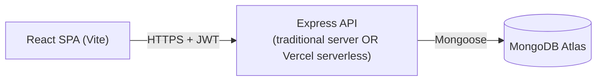

<div align="center">

# 🏠 Airbnb Clone

**A full-stack short-term-rental marketplace** — a public guest-facing site for
discovering and booking stays, plus a host admin dashboard for managing listings and
reservations, sharing one Node/Express/MongoDB API.

[](https://nodejs.org)
[](https://react.dev)
[](https://expressjs.com)
[](https://www.mongodb.com/atlas)
[](https://vitejs.dev)
[](https://vercel.com)

</div>

> **Honesty note:** this README describes exactly what exists in the codebase today —
> no CI pipeline, no automated test suite, and no license file currently exist in this
> repo, so you won't find badges claiming otherwise. See [`docs/EXECUTIVE_DOCUMENTATION.md`](docs/EXECUTIVE_DOCUMENTATION.md)
> for the full, code-verified technical write-up this README summarizes.

---

## Table of Contents

- [Features](#features)
- [Screenshots](#screenshots)
- [Architecture Overview](#architecture-overview)
- [Tech Stack](#tech-stack)
- [Project Structure](#project-structure)
- [Getting Started](#getting-started)
  - [Prerequisites](#prerequisites)
  - [Installation](#installation)
  - [Environment Setup](#environment-setup)
  - [Database Setup](#database-setup)
  - [Running Locally](#running-locally)
  - [Build](#build)
- [Deployment](#deployment)
- [API Documentation Summary](#api-documentation-summary)
- [Usage Examples](#usage-examples)
- [Security Notes](#security-notes)
- [Troubleshooting](#troubleshooting)
- [Contributing](#contributing)
- [License](#license)
- [Credits](#credits)
- [Support](#support)

---

## Features

**Guest experience**
- Home page: hero banner, curated destination cards, experience sections, footer
- Destination search with live typeahead suggestions (matches destinations *and* real listings)
- Location search results with a location/guest-count filter
- Listing details page: photo gallery + lightbox, expandable description/amenities,
  a real interactive two-month availability calendar synced live with the booking
  widget, review summary + review cards, host profile, policies panel, and a
  server-verified cost calculator
- JWT login **and** self-service sign-up (guest or host)
- Guest reservations page (view/cancel your own bookings)

**Host experience**
- Host dashboard ("My Hotel List") — create, update, delete listings with multipart
  image upload
- View and cancel reservations made against your listings

**Engineering**
- One Express app (`backend/app.js`) that runs unmodified as a traditional server
  *or* a Vercel serverless function — no duplicated routing logic
- Images stored as base64 `data:` URIs (no disk dependency — serverless-safe by design)
- Server-authoritative pricing: the client's cost preview is never trusted; the API
  recomputes and persists the real total
- Role-based route guards on both the API (`protect`/`requireHost` middleware) and the
  frontend (`PrivateRoute`/`HostRoute`)

## Screenshots

> _Add screenshots here — none are currently committed to the repo._

| Home Page | Listing Details | Host Dashboard |
|---|---|---|
| `docs/screenshots/home.png` | `docs/screenshots/listing-details.png` | `docs/screenshots/dashboard.png` |

## Architecture Overview



One Express app (`backend/app.js`), two possible entry points:
- `backend/server.js` — traditional `app.listen()`, for local dev or a host like Render/Railway.
- `backend/api/index.js` — Vercel serverless entry point, same app, no `listen()`.

Full diagrams (ERD, auth sequence, request lifecycle, deployment topology) live in
[`docs/ARCHITECTURE_DIAGRAMS.md`](docs/ARCHITECTURE_DIAGRAMS.md).

## Tech Stack

| Layer | Technology |
|---|---|
| Frontend | React 18, Vite 8, react-router-dom v6, axios, plain CSS (custom-property design tokens) |
| Backend | Node.js 20, Express 4, Mongoose 8 |
| Database | MongoDB (Atlas) |
| Auth | JWT (`jsonwebtoken`) + `bcryptjs` password hashing |
| File uploads | `multer` (memory storage → base64, serverless-safe) |
| Hosting | Vercel (two projects: frontend static build + backend serverless functions) |
| Local dev orchestration | `concurrently` |

No CI/CD tooling, containerization, test framework, caching layer, or monitoring
service is currently part of this project — see
[`docs/EXECUTIVE_DOCUMENTATION.md`](docs/EXECUTIVE_DOCUMENTATION.md) §12–13 and
[`docs/CODE_QUALITY_REVIEW.md`](docs/CODE_QUALITY_REVIEW.md) for the honest gap list and roadmap.

## Project Structure

```
Air BnB Clone 2/
├── backend/
│   ├── app.js              # Express app (routes + middleware), no listen()
│   ├── server.js            # traditional entry point (local dev / Render / Railway)
│   ├── api/index.js         # Vercel serverless entry point
│   ├── seed.js               # resets & seeds 2 demo users + 9 demo listings
│   ├── config/db.js          # cached Mongoose connection
│   ├── models/                # User, Accommodation, Reservation
│   ├── controllers/           # business logic per resource
│   ├── routes/                 # Express routers per resource
│   └── middleware/            # auth.js (JWT), upload.js (multer)
│
└── frontend/
    └── src/
        ├── api/                # axios client + one module per resource
        ├── context/AuthContext.jsx
        ├── components/         # layout / common / home / location / details / admin
        └── pages/               # public pages + pages/admin (host dashboard)
```

Full annotated structure: [`docs/EXECUTIVE_DOCUMENTATION.md`](docs/EXECUTIVE_DOCUMENTATION.md) §4.

## Getting Started

### Prerequisites
- Node.js **20.x** (pinned via `engines` in both `package.json` files)
- npm
- A MongoDB instance — either a local `mongod` or a free [MongoDB Atlas](https://www.mongodb.com/atlas) cluster

### Installation

```bash
git clone <this-repo-url>
cd "Air BnB Clone 2"
npm run install:all   # installs both backend/ and frontend/ dependencies
```

### Environment Setup

```bash
cp backend/.env.example backend/.env
cp frontend/.env.example frontend/.env
```

Edit `backend/.env`:

```env
PORT=5000
MONGO_URI=mongodb://127.0.0.1:27017/airbnb-clone   # or your Atlas connection string
JWT_SECRET=replace-this-with-a-long-random-string
JWT_EXPIRES_IN=7d
CLIENT_URL=http://localhost:5173
```

`frontend/.env` needs no changes for local dev (defaults to `http://localhost:5000`).

Full variable-by-variable reference (purpose, required/optional, security notes):
[`docs/EXECUTIVE_DOCUMENTATION.md`](docs/EXECUTIVE_DOCUMENTATION.md) §9.

### Database Setup

No migrations exist — Mongoose creates collections implicitly on first write. To get
demo data:

```bash
npm run seed
```

This **destructively** resets and seeds:
- Guest account — `john@example.com` / `password123`
- Host account — `jane@example.com` / `password321`
- 9 sample listings across 8 cities, each with individually-verified real photos

⚠️ `seed.js` runs `deleteMany({})` on every collection first. Never point it at a
database you care about.

### Running Locally

```bash
npm run dev
```

Runs both apps via `concurrently`:
- Frontend: http://localhost:5173
- Backend: http://localhost:5000

### Build

```bash
cd frontend && npm run build   # outputs frontend/dist
```

The backend has no build step (plain CommonJS Node.js).

## Deployment

Deployed as **two separate Vercel projects** against this same repository — see the
full step-by-step (env vars, MongoDB Atlas network access, why two projects instead of
one) in [`docs/EXECUTIVE_DOCUMENTATION.md`](docs/EXECUTIVE_DOCUMENTATION.md) §10.

Quick version:

| Project | Root Directory | Key env vars |
|---|---|---|
| Backend | `backend` | `MONGO_URI`, `JWT_SECRET`, `JWT_EXPIRES_IN`, `CLIENT_URL` |
| Frontend | `frontend` | `VITE_API_URL` |

Both `backend/vercel.json` (serverless rewrite) and `frontend/vercel.json` (SPA
fallback rewrite) are already committed.

## API Documentation Summary

Base URL: `{API_ORIGIN}/api`. Full request/response examples, validation rules, and
error shapes: [`docs/EXECUTIVE_DOCUMENTATION.md`](docs/EXECUTIVE_DOCUMENTATION.md) §6.

| Method | Route | Auth | Purpose |
|---|---|---|---|
| POST | `/users/register` | — | Create account, returns JWT |
| POST | `/users/login` | — | Log in, returns JWT |
| GET | `/users/me` | JWT | Current session user |
| GET | `/accommodations` | — | Search/list listings (`?location=&guests=`) |
| GET | `/accommodations/host/mine` | JWT + host | Host's own listings |
| GET | `/accommodations/:id` | — | Single listing |
| POST | `/accommodations` | JWT + host | Create listing (multipart) |
| PUT | `/accommodations/:id` | JWT + host + owner | Update listing |
| DELETE | `/accommodations/:id` | JWT + host + owner | Delete listing (cascades reservations) |
| POST | `/reservations` | JWT | Book a stay (server computes price) |
| GET | `/reservations/user` | JWT | Guest's own bookings |
| GET | `/reservations/host` | JWT | Bookings on the host's listings |
| DELETE | `/reservations/:id` | JWT | Cancel (guest or host) |
| GET | `/health` | — | Liveness check |

## Usage Examples

**Register a host and create a listing:**

```bash
curl -X POST http://localhost:5000/api/users/register \
  -H "Content-Type: application/json" \
  -d '{"username":"Jane Doe","email":"jane@example.com","password":"password321","role":"host"}'
# => { "token": "...", "user": { "role": "host", ... } }

curl -X POST http://localhost:5000/api/accommodations \
  -H "Authorization: Bearer <token>" \
  -F "title=Modern Loft" -F "location=Austin" \
  -F "description=A bright, modern loft in downtown Austin." \
  -F "bedrooms=2" -F "bathrooms=1" -F "guests=4" \
  -F "type=Entire apartment" -F "price=180" \
  -F "images=@./photo1.jpg"
```

**Book a stay as a guest:**

```bash
curl -X POST http://localhost:5000/api/reservations \
  -H "Authorization: Bearer <guest-token>" -H "Content-Type: application/json" \
  -d '{"accommodationId":"<id>","checkIn":"2026-08-10","checkOut":"2026-08-17","guests":2}'
```

## Security Notes

- JWT is stored in `localStorage` on the client — convenient, but readable by any script
  that achieves XSS on the page (no httpOnly cookie is used). See the mitigation
  recommendation in [`docs/CODE_QUALITY_REVIEW.md`](docs/CODE_QUALITY_REVIEW.md).
- **No rate limiting** exists on `/login` or `/register` — do not deploy this as-is
  somewhere that needs brute-force protection without adding `express-rate-limit` first.
- CORS `origin` **defaults to `*`** if `CLIENT_URL` is unset — always set it explicitly in production.
- Passwords are bcrypt-hashed (10 rounds) and never returned by default queries.
- Ownership is re-checked server-side on every listing/reservation mutation, not just role.

Full security analysis: [`docs/EXECUTIVE_DOCUMENTATION.md`](docs/EXECUTIVE_DOCUMENTATION.md) §11.

## Troubleshooting

| Symptom | Likely cause / fix |
|---|---|
| `EADDRINUSE` on port 5000/5173 | A previous dev process is still bound to the port. Find and kill it (`lsof -i :5000` / on Windows `netstat -ano \| findstr :5000` then `taskkill /F /PID <pid>`), then restart `npm run dev`. |
| `401 Not authorized` on every request | Token missing/expired — log in again; check `Authorization: Bearer <token>` is actually being sent. |
| `403 Only hosts can perform this action` | The logged-in account has `role: 'user'`, not `'host'` — register with the "I want to host" checkbox, or use the seeded host account. |
| Images fail to upload | File exceeds 1.5MB or more than 5 images submitted — both are enforced server-side (see §6.2 in the executive doc), returns `400`. |
| CORS error in the browser console | `CLIENT_URL` on the backend doesn't match the frontend's actual origin. |
| `Mongo connection error` on startup | `MONGO_URI` unset/incorrect, or (Atlas) your IP isn't allow-listed under Network Access. |
| Frontend routes 404 on refresh (production) | `frontend/vercel.json`'s SPA rewrite isn't deployed/detected — confirm the file exists at the frontend project's root directory. |

## Contributing

There is no `CONTRIBUTING.md` or formal contribution process defined yet. In the
meantime:
1. Open an issue describing the change before large PRs.
2. Follow the existing code style (see [`docs/DEVELOPER_GUIDE.md`](docs/DEVELOPER_GUIDE.md) for conventions actually used in this codebase).
3. Since no automated tests exist, manually verify your change against the running app
   before opening a PR, and describe how you tested it in the PR description.

## License

**No `LICENSE` file currently exists in this repository.** Until one is added, all
rights are reserved by default under standard copyright law — treat this as
**not** open for reuse/redistribution unless the project owner adds an explicit license
(e.g., MIT) and states otherwise.

## Credits

- Built as a full-stack MERN portfolio/assessment project.
- Listing photography: individually verified real estate photos from
  [Unsplash](https://unsplash.com), hardcoded via direct image URLs in `backend/seed.js`
  and `frontend/src/data/destinations.js` (no live Unsplash API integration).
- Logo: the Airbnb "Bélo" mark, sourced from [Simple Icons](https://simpleicons.org) (CC0).

## Support

No support channel (Discord/Slack/issue templates) is currently set up. For now, open a
GitHub issue on this repository describing the problem, including steps to reproduce.
# AirBnb-Clone

