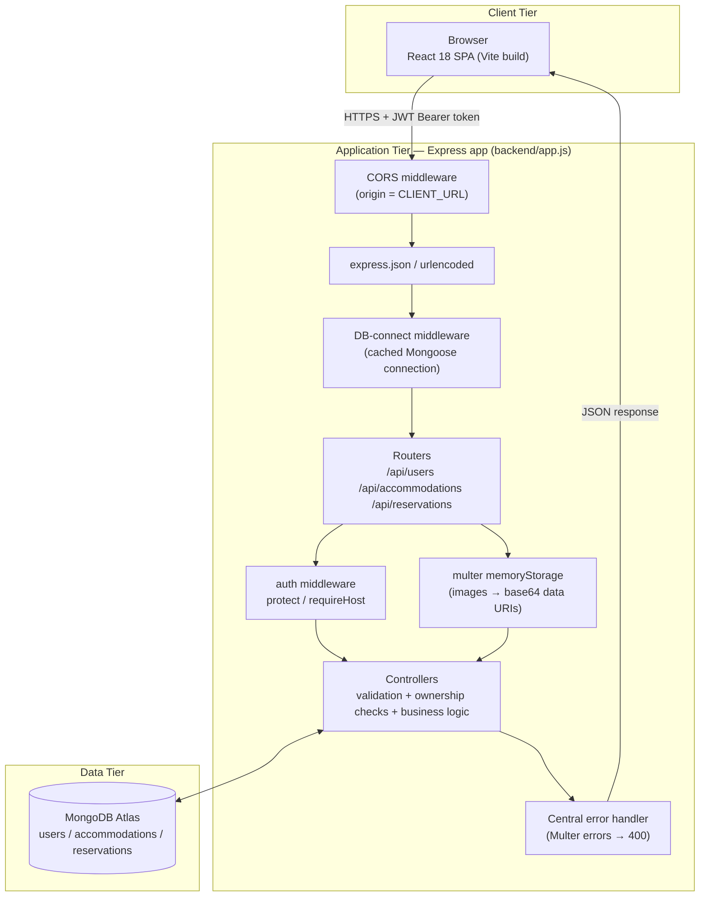
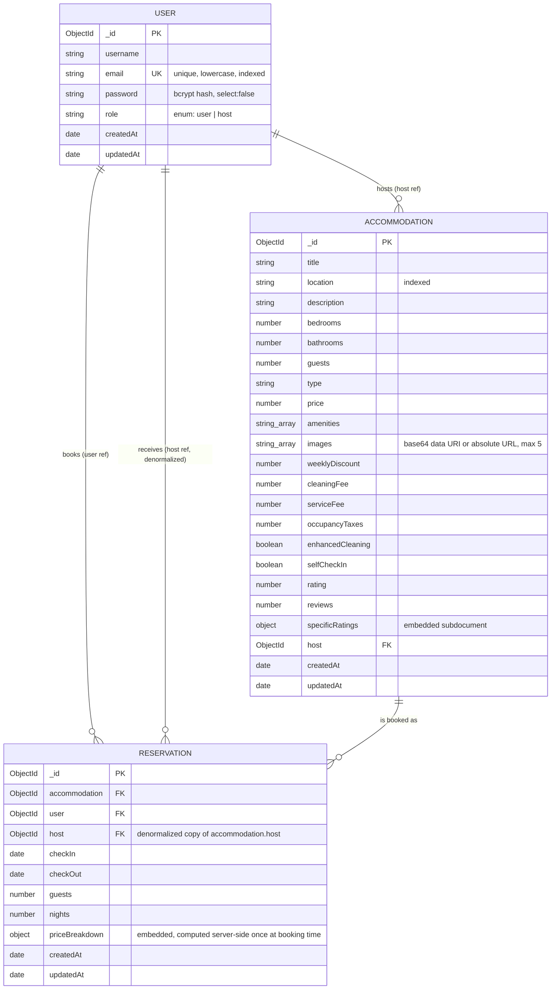
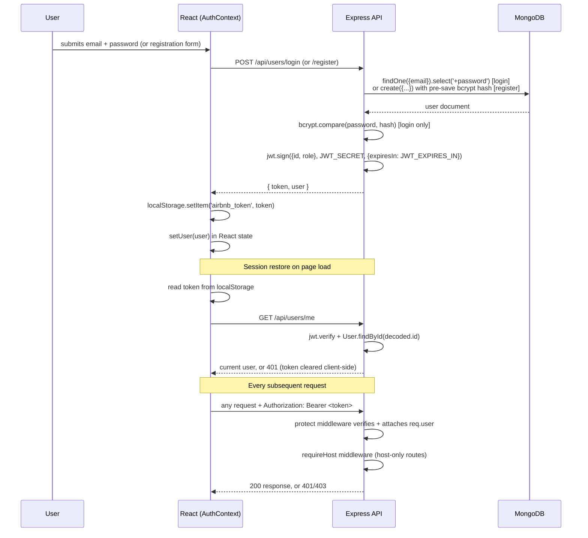
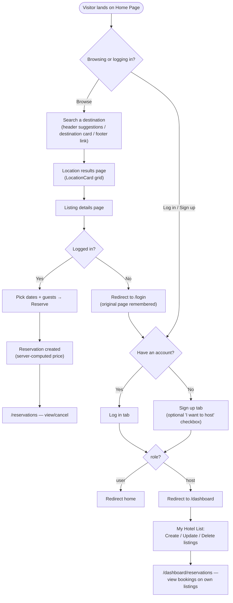
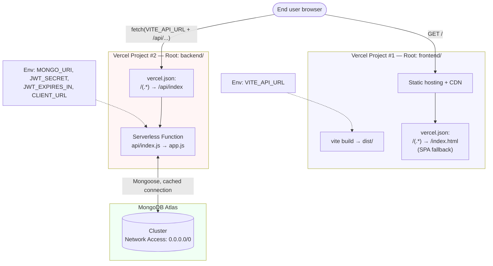

# Architecture Diagrams

Consolidated reference of every diagram referenced across the documentation set. All
diagrams are Mermaid and render natively on GitHub. Source of truth for the claims
embedded in these diagrams is the actual code — see
`docs/EXECUTIVE_DOCUMENTATION.md` for the file-by-file detail behind each box.

---

## 1. System Architecture



**Key architectural fact:** the same `app.js` is imported by both `server.js`
(traditional, calls `app.listen()`) and `api/index.js` (Vercel serverless, does not call
`listen()`) — there is exactly one copy of the routing/middleware logic, not two
maintained in parallel.

---

## 2. Database ERD



---

## 3. Authentication Flow



---

## 4. User Journey



---

## 5. Request Lifecycle (single request, detailed)

```mermaid
sequenceDiagram
    participant C as Client (axios)
    participant CORS as CORS middleware
    participant BP as Body parser
    participant DB as DB-connect middleware
    participant R as Router
    participant A as auth.js
    participant U as upload.js (multipart only)
    participant Ctrl as Controller
    participant M as Mongoose Model
    participant Mongo as MongoDB

    C->>CORS: HTTP request (+ Authorization header if authenticated)
    CORS->>BP: origin allowed (matches CLIENT_URL)
    BP->>DB: body parsed
    DB->>DB: connectDB() — cached; instant if already connected (readyState === 1)
    DB->>R: next()
    alt route requires auth
        R->>A: protect middleware
        A->>A: jwt.verify(token, JWT_SECRET)
        A->>A: User.findById(decoded.id)
        A->>R: req.user attached
    end
    alt route requires host role
        R->>A: requireHost middleware
        A->>R: req.user.role === 'host' ? next() : 403
    end
    alt multipart request (create/update listing)
        R->>U: multer.array('images', 5)
        U->>U: buffer files in memory, filter by mimetype, enforce size/count limits
        U->>R: req.files populated (or 400 MulterError)
    end
    R->>Ctrl: controller function invoked
    Ctrl->>Ctrl: validatePayload() / inline business rules / ownership check
    Ctrl->>M: Model.create / find / findById / save / deleteOne
    M->>Mongo: MongoDB wire protocol query
    Mongo-->>M: document(s)
    M-->>Ctrl: Mongoose document(s)
    Ctrl-->>C: res.json(...) with status code (200/201/400/401/403/404/500)
```

---

## 6. Deployment Architecture



**Why two projects, not one:** the frontend is a static SPA build with its own
framework preset (Vite) and the backend is a Node API best run as serverless functions
— different build steps, different runtimes. Keeping them as two Vercel projects (a
common pattern for MERN-style apps on Vercel) means either half can be redeployed
independently and neither `vercel.json` has to do double duty.
